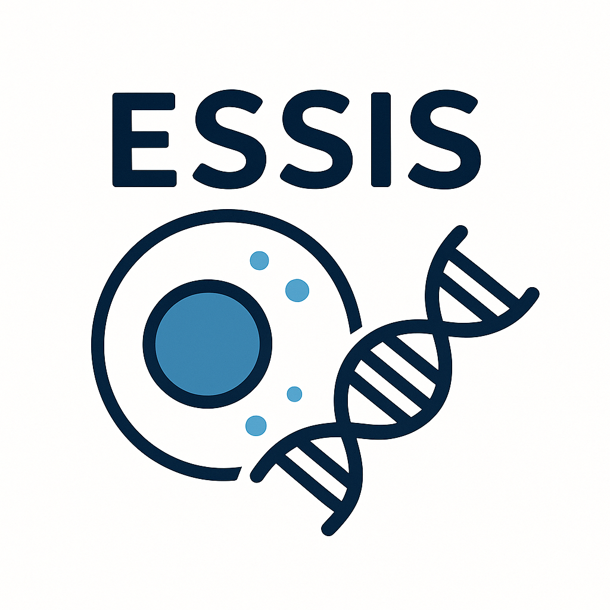

# ESSIS (Effector Somatic SNV and INDEL Seeker)
In silico pipeline for predicting functionally significant somatic single-nucleotide variants and indels in multiple regions of sample genomes.

## Table of Contents

• Introduction  
   ◦ What is ESSIS?  
   ◦ How does it work in summary?

• Dependencies and Installation  
   ◦ Install dependencies via conda  
   ◦ Install auxiliary dependencies  
   ◦ Install ESSIS

• Input  
• Usage  
• Output
